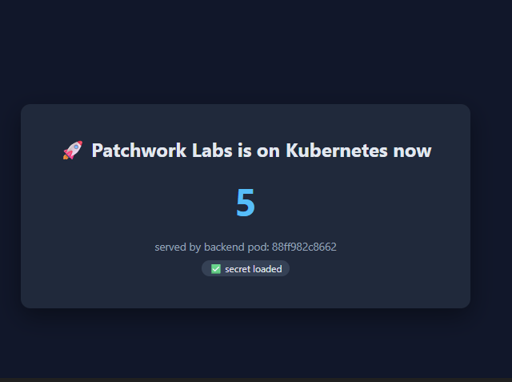
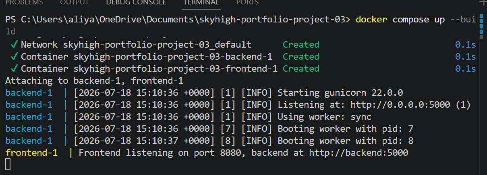
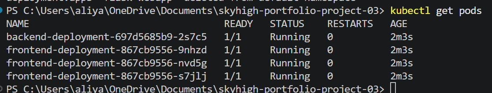
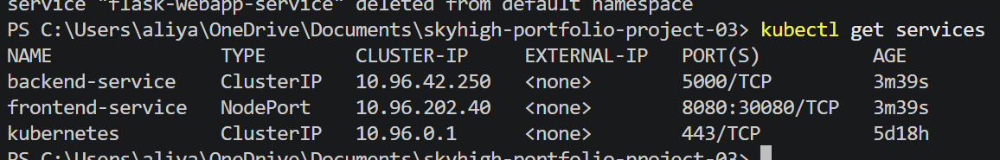
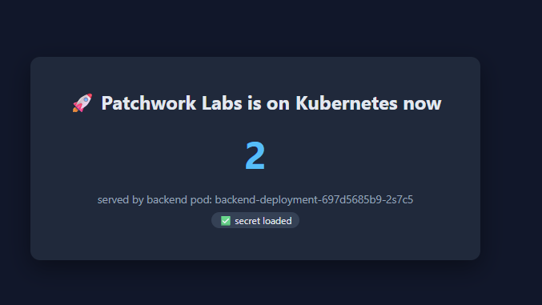

# 🚀 Skyhigh Portfolio Project 3 — Ship It with Docker and Kubernetes

A two-service microservices app — containerized with Docker, tested locally
with Docker Compose, pushed to Docker Hub, and deployed to Kubernetes with
3 horizontally-scaled frontend replicas, automated health checks, and
configuration cleanly separated from code via a ConfigMap and Secret.

## 📋 The Scenario

Patchwork Labs had been running its entire product on a single EC2
instance for two years — one server, no redundancy, downtime on every
deploy, total outage if that one box went down. This project breaks that
monolith into two independent, horizontally-scalable services running on
Kubernetes: zero-downtime deploys, automatic recovery from crashes, and
real horizontal scaling — with every manifest written from scratch.

## 🏗️ Architecture
Browser  ───────────▶ │   frontend-service       │
(localhost)             │   (Kubernetes Service)   │
└───────────┬─────────────┘
│ load-balances across
┌───────────────┼───────────────┐
▼               ▼               ▼
frontend pod    frontend pod    frontend pod
(Node/Express)  (Node/Express)  (Node/Express)
│               │               │
└───────────────┼───────────────┘
│ proxies /api/data to
▼
┌─────────────────────────┐
│   backend-service        │
│   (ClusterIP, internal)  │
└───────────┬─────────────┘
▼
backend pod
(Python/Flask)
│
reads config from:
┌──────────────┴──────────────┐
▼                              ▼
ConfigMap: skyhigh-config     Secret: skyhigh-secret
(BACKEND_URL)                 (API_KEY)

## 🧰 Tech Stack

| Layer | Technology |
|---|---|
| Frontend | Node.js + Express |
| Backend | Python + Flask, served via Gunicorn |
| Containerization | Docker (`node:20-alpine`, `python:3.11-slim`) |
| Local orchestration | Docker Compose |
| Production orchestration | Kubernetes |
| Registry | Docker Hub |

## 📁 Project Structure
skyhigh-portfolio-project-03/
├── backend/
│   ├── app.py
│   ├── requirements.txt
│   └── Dockerfile
├── frontend/
│   ├── server.js
│   ├── package.json
│   ├── Dockerfile
│   └── public/
│       └── index.html
├── k8s/
│   ├── configmap.yaml
│   ├── secret.yaml
│   ├── backend-deployment.yaml
│   ├── backend-service.yaml
│   ├── frontend-deployment.yaml
│   └── frontend-service.yaml
├── screenshots/
├── docker-compose.yml
└── README.md

## ✅ Prerequisites

- Docker Desktop, with Kubernetes enabled (Settings → Kubernetes → Enable Kubernetes)
- `kubectl`
- A Docker Hub account

## 🚀 Running It Locally with Docker Compose

```bash
docker compose up --build
```

Open `http://localhost:8080`. You should see the frontend, a counter
that climbs every 3 seconds, and confirmation that the backend's secret
loaded correctly.

## ☸️ Running It on Kubernetes

**1. Build and push both images** (swap in your own Docker Hub username):
```bash
docker build -t aliyahwater/skyhigh-backend:v1 ./backend
docker build -t aliyahwater/skyhigh-frontend:v1 ./frontend
docker push aliyahwater/skyhigh-backend:v1
docker push aliyahwater/skyhigh-frontend:v1
```

**2. Deploy everything:**
```bash
kubectl apply -f k8s/
```

**3. Verify:**
```bash
kubectl get pods
kubectl get services
```
Expect 1 backend pod and 3 frontend pods, all `1/1 Running`, plus
`backend-service` (ClusterIP) and `frontend-service` (NodePort) listed.

**4. Access the app.** On Docker Desktop's newer `kind`-based local
cluster, NodePort isn't always forwarded to `localhost` automatically.
If `http://localhost:30080` doesn't load, tunnel in directly instead:
```bash
kubectl port-forward svc/frontend-service 8080:8080
```
Then open `http://localhost:8080`.

## 📸 Screenshots

| Screenshot | Preview |
|------------|---------|
| Docker Compose — browser |  |
| Docker Compose — terminal |  |
| kubectl get pods |  |
| kubectl get services |  |
| Live on Kubernetes |  |

## 🐛 Challenges & Solutions

**NodePort unreachable on localhost.** All 4 pods deployed and showed
`Running`, and `kubectl get endpoints frontend-service` confirmed the
Service was correctly routing to all 3 ready pod IPs — ruling out a
label-selector mismatch. The real cause: Docker Desktop's local cluster
runs on `kind` (Kubernetes-in-Docker), where the "node" is itself a
container, so host-level NodePort forwarding isn't automatic the way it
was on older Docker Desktop Kubernetes setups. **Fix:** used
`kubectl port-forward svc/frontend-service 8080:8080` to tunnel directly
to the Service. In a real cloud cluster (EKS/GKE/AKS), a `LoadBalancer`
type would provision a real external IP and this wouldn't come up.

**Stale resources cluttering the cluster.** An unrelated `flask-webapp`
Deployment and Service from an earlier exercise were still running on
the same local cluster, stuck in `ImagePullBackOff` for days, and showing
up in `kubectl get pods`/`get services` output. Cleaned up with
`kubectl delete deployment flask-webapp` and
`kubectl delete service flask-webapp-service`. Good reminder that local
clusters accumulate cruft the same way real ones do — always verify
you're reading output that belongs to the deployment you're debugging.

## 🔐 Security Notes

- `backend-service` is `ClusterIP` — internal only, never exposed
  directly to the internet.
- Config and secrets are injected via environment variables from a
  ConfigMap/Secret at runtime — never hardcoded into the images.
- Kubernetes Secrets are Base64-**encoded**, not encrypted — anyone
  with `kubectl get secret` access could decode the value trivially.
  Fine for this demo's placeholder key; a real deployment would use
  AWS Secrets Manager or Sealed Secrets instead.
- Neither container currently runs as a non-root user — a hardened
  image would add a dedicated `USER` in the Dockerfile.

## 🔄 What I'd Do Differently in Production

- **Ingress controller** instead of NodePort — one controlled entry
  point with real routing rules, instead of a raw port opened cluster-wide.
- **Horizontal Pod Autoscaler** on the frontend, scaling replicas by
  actual CPU load instead of a fixed `replicas: 3`.
- **NetworkPolicies** restricting the backend to only accept traffic
  from pods labeled `app: frontend`.
- **Real secrets management** via AWS Secrets Manager or Sealed Secrets.
- **Non-root containers** in both Dockerfiles.
- **Helm chart** to package these 6 manifests into one reusable,
  parameterized deployment.

  ## 🔜 Next Steps
- Add CI/CD pipeline with GitHub Actions
- Set up Helm chart for deployment

## 💡 Key Learnings

- The difference between a Deployment's `matchLabels`/pod-template
  labels (how it manages *its own* pods) and a Service's `selector`
  (how it finds *any* pods to route to) — two separate matching
  relationships that happen to use the same label.
- `readinessProbe` vs `livenessProbe`: one pulls a pod out of traffic
  rotation, the other kills and restarts the container.
- Kubernetes Secrets protect against casual exposure, not against
  anyone with real cluster access — Base64 is encoding, not encryption.
- Local Kubernetes (kind) doesn't always mirror real cloud cluster networking — kubectl port-forward is a standard tool for bridging that gap during development.

## 👤 Author

**Aliyah Waterman**
GitHub: [@AliyahWaterman](https://github.com/AliyahWaterman)

## 📄 License
This project is for portfolio/educational purposes.

## 🤝 Contributing
This is a personal portfolio project, not currently open to contributions.